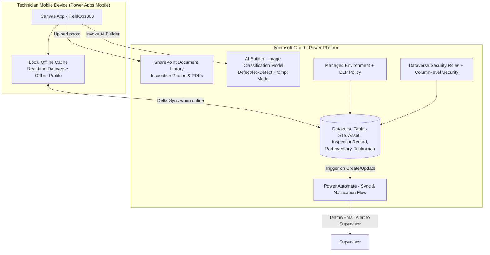

# Project 1 — FieldOps360: Offline-First Canvas App for Field Service Inventory & Site Inspections

**Pillar:** Power Apps (Canvas App)
**Difficulty:** Enterprise POC
**Data Source:** Microsoft Dataverse (primary) + SharePoint (document/image library)
**Platform baseline:** Power Platform 2026 Release Wave 1 (GA April 2026)

---

**🔗 Live HTML mockup (look & feel preview):** [Canvas App mockup](https://rahul7387.github.io/powerplatform-enterprise-poc-projects/projects/01-canvas-field-ops/index.html)

---

## 1. Business Scenario

A facilities/field-service organization has technicians visiting sites with unreliable connectivity (basements, rural sites, warehouses). They need to:
- Check stock/parts inventory in real time when connected
- Log site inspections, capture photos, and record GPS-tagged findings even **offline**
- Auto-sync back to Dataverse when connectivity returns, with conflict resolution
- Get AI-assisted defect classification from photos on the spot

This is the kind of app that used to require native mobile dev (Xamarin/Swift/Kotlin) — the POC shows it can be delivered low-code with enterprise-grade reliability.

## 2. Why This Demonstrates Senior-Level Capability

- Real offline architecture decisions (delta sync, conflict handling, local caching limits) — not just "Canvas App CRUD"
- Data modeling in Dataverse with proper relationships, choices, business rules, and security roles (not a flat SharePoint list)
- Use of the **2026 Wave 1 real-time offline-first Dataverse access** capability for Canvas Apps (replaces older manual `SaveData`/`LoadData` collection patterns)
- Component-based UI architecture (reusable PCF-style components / Canvas component library) instead of copy-pasted screens
- Embedded AI Builder object/prompt-based model inside the canvas app for defect photo classification
- ALM: solution-aware app, environment variables, connection references (not hardcoded connections)

## 3. Architecture

## 4. Step-by-Step Implementation

### Phase 0 — Environment & Governance Setup
1. Provision a **Managed Environment** in Power Platform Admin Center (`Dev`, `Test`, `Prod`).
2. Apply a **DLP policy** restricting connectors to Dataverse, SharePoint, Outlook, Teams, and AI Builder only.
3. Create an **Application User** (service principal) for automated deployment pipelines.

### Phase 1 — Data Modeling (Dataverse)
4. Create custom tables: `Site`, `Asset`, `InspectionRecord`, `PartInventory`, `DefectLog`.
5. Define relationships (1:N Site→Asset, N:N Asset↔PartInventory via junction).
6. Add **Business Rules** (e.g., if `Condition = Critical`, require `Photo` and `Notes`).
7. Configure **Security Roles**: `Field Technician` (create/read own records), `Supervisor` (read/update all in territory via Business Unit), `Admin`.
8. Enable **column-level security** on cost-sensitive fields (e.g., `PartInventory.UnitCost`).

### Phase 2 — Canvas App Build
9. Create the Canvas App **inside a Solution** (never outside — this is the #1 ALM mistake juniors make).
10. Build a reusable **Component Library**: `HeaderNav`, `PhotoCaptureCard`, `StatusBadge`, `OfflineIndicator`.
11. Configure the app's **offline profile** using the new Wave 1 real-time offline-first Dataverse capability — define which tables/records sync (filtered by technician's assigned Site).
12. Implement `Set(varConnectivity, Connection.Connected)` pattern + custom offline banner using `HeaderNav`.
13. Build screens: `SiteList`, `AssetDetail`, `InspectionForm`, `PhotoCapture`, `SyncStatus`.
14. Wire `Patch()` to local cache; rely on platform sync engine to push to Dataverse (no manual JSON queueing needed with the new offline profile model).

### Phase 3 — AI Builder Integration
15. Train an **AI Builder Image Classification model** (or use a **Prompt Builder** GPT-based image+text prompt) on sample defect photos (rust, cracks, leaks vs. normal).
16. Publish model, embed `AI Builder` control on `PhotoCapture` screen — auto-tag `DefectLog.Severity`.

### Phase 4 — Automation
17. Build a **Power Automate cloud flow**: Dataverse trigger `On Create of InspectionRecord where Condition = Critical` → Adaptive Card in Teams to Supervisor → approval → update `WorkOrder` status.
18. Add SharePoint flow step to auto-organize photos into `/Sites/{SiteName}/{Date}/` folder structure.

### Phase 5 — ALM & Deployment
19. Export solution as **managed solution**; set up **GitHub-integrated ALM** (2026 Wave 1 native "Deploy from Git" / pipelines) so solution changes flow Dev → Test → Prod via pull request + pipeline, not manual export/import.
20. Add **environment variables** and **connection references** so no hardcoded URLs/connections travel between environments.
21. Document rollback plan and version history in `CHANGELOG.md`.

## 5. Demo script
1. Open app online → show real-time Dataverse data.
2. Turn on airplane mode → keep working (create inspection, snap photo, AI auto-tags severity).
3. Turn connectivity back on → show automatic delta sync and Teams approval card firing.
4. Show the Dataverse security role difference by logging in as a Technician vs Supervisor.
5. Show the solution in GitHub with pipeline history (ALM maturity).

## 6. Skills This Project Proves
Data modeling, offline-first UX architecture, AI Builder, Power Automate, security role design, managed environments, DLP, solution ALM via Git — the full stack a senior Power Platform architect owns end-to-end.
