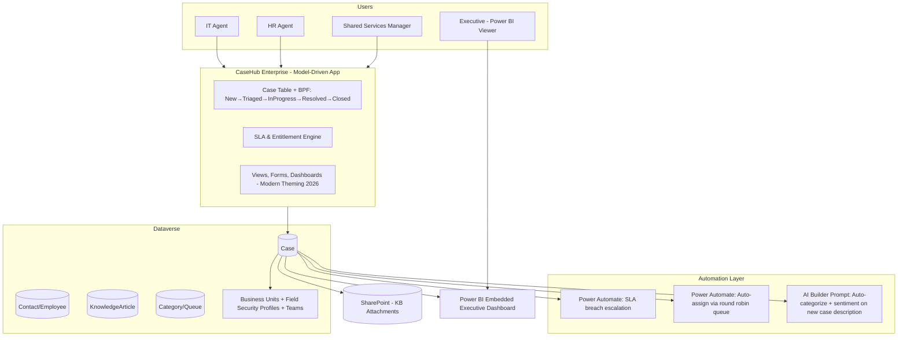

# Project 2 — CaseHub Enterprise: Model-Driven App for IT/HR Shared Services Case Management

**Pillar:** Power Apps (Model-Driven App)
**Difficulty:** Enterprise POC
**Data Source:** Microsoft Dataverse (primary), SharePoint (knowledge base attachments)
**Platform baseline:** Power Platform 2026 Release Wave 1 — refreshed model-driven UI + standardized modern theming, enhanced grid search

---

**🔗 Live HTML mockup (look & feel preview):** [Model-Driven App mockup](https://rahul7387.github.io/powerplatform-enterprise-poc-projects/projects/02-model-driven-case-mgmt/index.html)

---

## 1. Business Scenario

A shared-services function (IT Helpdesk + HR case management combined) needs a single, secure system of record to:
- Intake, triage, assign, and resolve cases/tickets across two departments with different SLAs
- Enforce security so HR cases (sensitive) are invisible to IT agents and vice versa, while managers see both
- Provide dashboards, SLA timers, and automatic escalation
- Give leadership an executive Power BI-embedded view

Model-driven apps are the right tool here — this is a **process- and data-heavy** system of record, not a lightweight canvas UI.

## 2. Why This Demonstrates Senior-Level Capability

- Correct tool selection (model-driven vs canvas) — juniors default to canvas for everything
- Complex **security model**: Business Units, Teams, Field Security Profiles, hierarchy security — not just "everyone sees everything"
- **Business Process Flows (BPF)** enforcing a governed case lifecycle
- Server-side **Business Rules + Classic Workflows/Power Automate** combination used appropriately
- SLA/Entitlement records using native Dataverse SLA engine (timers, escalation actions) — a feature most Power Apps devs never touch
- Embedded Power BI + Dataverse analytics, and the 2026 modernized model-driven UI/theming applied consistently

## 3. Architecture

## 4. Step-by-Step Implementation

### Phase 0 — Security Foundation (do this FIRST, not last)
1. Create **Business Units**: `IT-Shared-Services`, `HR-Shared-Services`, `Leadership`.
2. Create **Security Roles** per BU with table-level and **Field Security Profiles** for sensitive fields (e.g., HR case `MedicalDetails` field hidden from IT role entirely).
3. Enable **hierarchy security** so managers see subordinate cases without needing "God mode" System Administrator role (a very common anti-pattern to call out to your manager).

### Phase 1 — Data Model
4. Tables: `Case` (extend or custom `ss_case`), `Category`, `Queue`, `KnowledgeArticle`, `SLA`, `Entitlement`.
5. Configure **Queues** for IT and HR with routing rules.
6. Set up native **SLA records**: Warning at 80% of resolution time, Failure action triggers Power Automate escalation.

### Phase 2 — Process
7. Build a **Business Process Flow**: `New → Triaged → In Progress → Pending Customer → Resolved → Closed`, with stage-specific required fields.
8. Add **Business Rules** for conditional field visibility (e.g., "Escalation Reason" required only if reopened >1 time).

### Phase 3 — Model-Driven App Design
9. Build the app using the **2026 modern app designer** — apply standardized modern theming, configure the refreshed navigation (grouped site map: My Cases, Team Queue, Knowledge Base, Reports).
10. Configure enhanced **grid search** (Wave 1 feature) on the Case table for agents to instantly find related tickets.
11. Build role-tailored **dashboards**: Agent dashboard (my open cases, SLA countdown), Manager dashboard (team load, breach risk), Executive Power BI tile.

### Phase 4 — Intelligence & Automation
12. Add an **AI Builder prompt** (GPT-based, Prompt Builder in Power Automate) that reads new case description text and auto-populates `Category` and `Sentiment` fields on create.
13. Build a **Power Automate flow**: `On SLA Warning` → Adaptive Card notification to Agent's Teams; `On SLA Failure` → auto-reassign to Manager queue.
14. Round-robin auto-assignment flow using a rotating `Queue` counter in Dataverse.

### Phase 5 — Reporting & ALM
15. Embed **Power BI report** (connected via Dataverse analytics/Direct Lake) inside a model-driven app dashboard tab.
16. Package as managed **Solution**, set environment variables for SLA thresholds so they're configurable per environment without code changes.
17. Set up solution checker + automated pipeline (GitHub Actions/Azure DevOps) with a "solution health check" gate before Prod deployment.

## 5. Demo script
1. Log in as IT Agent — show HR cases are completely invisible (security proof, not just UI hiding).
2. Create a new case, show AI auto-categorization firing instantly.
3. Walk the BPF stages, show SLA timer visually.
4. Force an SLA breach (or fast-forward via test data) → show Teams escalation card.
5. Switch to Manager view → hierarchy security shows team's cases automatically.
6. Show Executive Power BI dashboard embedded live in the app.

## 6. Skills This Project Proves
Enterprise Dataverse security modeling, SLA/entitlement configuration, BPF governance, AI-assisted triage, Power BI embedding, and solution ALM — the core competencies expected of a Power Platform Solution Architect.
