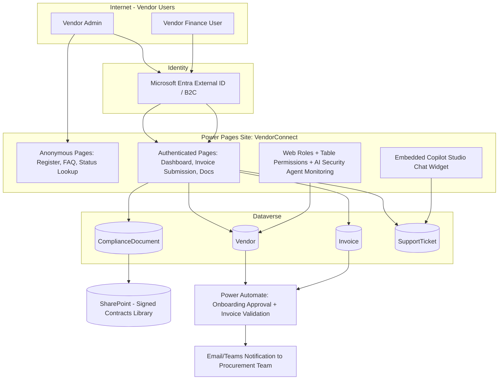

# Project 3 — VendorConnect: Power Pages External Vendor Self-Service Portal

**Pillar:** Power Pages
**Difficulty:** Enterprise POC
**Data Source:** Microsoft Dataverse (primary), SharePoint (contract documents)
**Platform baseline:** Power Platform 2026 Release Wave 1 — AI-powered site generation, AI-powered security agent, enhanced authentication controls, enhanced analytics

---

## 1. Business Scenario

A mid-size enterprise has 300+ external vendors who currently email spreadsheets for onboarding, invoice submission, and compliance document uploads. Procurement wants a secure external-facing portal where vendors can:
- Register and go through a self-service onboarding workflow (KYC/compliance doc upload)
- Submit and track invoices/POs
- See payment status
- Raise support tickets, and get instant answers from an embedded chat agent

This is a genuine **external-facing, anonymous + authenticated identity** scenario — the kind of project that separates people who've only built internal canvas apps from people who've shipped public-facing portals with real security requirements.

## 2. Why This Demonstrates Senior-Level Capability

- External identity provider integration (Azure AD B2C / Entra External ID) — not "everyone is an authenticated employee"
- **Table permissions + web roles** correctly scoped so Vendor A can never see Vendor B's data (a very common real-world security bug)
- Use of the **2026 AI-powered security agent** for continuous portal risk assessment, plus **AI-generated pages** to accelerate build
- Multi-step form with file upload validation, virus-scanning consideration, and Power Automate-driven approval workflow
- Production concerns: rate limiting, CAPTCHA/bot protection, WCAG accessibility, and portal analytics for adoption tracking

## 3. Architecture

## 4. Step-by-Step Implementation

### Phase 0 — Identity & Security Design
1. Configure **Microsoft Entra External ID** (or Azure AD B2C) as the authentication provider for external vendor identities — separate from internal employee tenant.
2. Design **Web Roles**: `Anonymous Users`, `Vendor Standard`, `Vendor Admin`.
3. Design **Table Permissions** scoped to "Vendor Admin sees only records where `Vendor` = current contact's parent account" — enforce at Dataverse row level, not just page hiding.
4. Enable the **2026 AI-powered security agent** for the site — configure it to flag anomalous access patterns (e.g., a vendor account suddenly querying many other vendor records).

### Phase 1 — Data Model
5. Tables: `Vendor`, `ComplianceDocument`, `Invoice`, `SupportTicket`, linked to existing `Account`/`Contact`.
6. Add **column-level security** on internal-only fields (e.g., `Vendor.InternalRiskScore` must never render on the portal even by accident).

### Phase 2 — Site Build
7. Use **AI-powered site generation** (Wave 1 capability) to scaffold the initial page structure from a natural-language description of the portal's purpose, then customize.
8. Build **Anonymous pages**: Landing, Vendor Registration Request, FAQ, Status Lookup (by reference number only, no PII exposed).
9. Build **Authenticated pages**: Vendor Dashboard, Invoice Submission (multi-step form + file upload with type/size validation), Document Center, Support Tickets.
10. Apply **WCAG 2.1 AA accessibility** checks using the built-in accessibility checker.

### Phase 3 — Automation
11. Build a **Power Automate flow**: `On Vendor Registration Submit` → route to Procurement approver via Teams Approval → on approval, provision Web Role + send welcome email with portal link.
12. Build an **Invoice validation flow**: on submission, validate against `PO` table (amount/line match), auto-flag mismatches for manual review, else route to Finance queue.
13. Add rate-limiting/bot protection (CAPTCHA on anonymous forms) and configure **portal analytics** (Wave 1 enhanced analytics) to track drop-off in the onboarding funnel.

### Phase 4 — Conversational Layer
14. Embed a **Copilot Studio agent** ("VendorConnect Assistant") on authenticated pages, grounded on the compliance FAQ + a live lookup action to `SupportTicket`/`Invoice` status via a custom connector or Dataverse connector action.

### Phase 5 — ALM & Ops
15. Package the site as part of a **Solution**, use the Power Pages CLI / VS Code extension for source-control-based development (Git-based site content), not exclusively the browser Design Studio.
16. Deploy through Dev → UAT → Prod site environments with environment variables per stage (site URLs, connection references).

## 5. Demo Script
1. Show anonymous registration flow → approval in Teams → welcome email.
2. Log in as Vendor A, submit an invoice, show validation flow catch a PO mismatch.
3. Try (in a test/staging way) to demonstrate Vendor A cannot see Vendor B's invoices — prove table permissions.
4. Ask the embedded Copilot chat "What's the status of my last invoice?" and get a grounded, personalized answer.
5. Show the AI security agent's risk dashboard for the site.

## 6. Skills This Project Proves
External identity architecture, Dataverse row-level security for multi-tenant-style external access, Power Pages governance, AI-assisted site generation, and embedded Copilot integration — core skills for enterprise customer/partner portal delivery.
