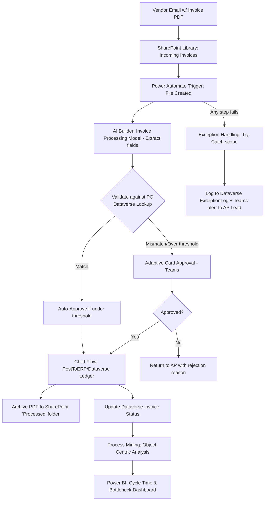

# Project 4 — InvoiceFlow AP: End-to-End Accounts Payable Automation with Power Automate

**Pillar:** Power Automate (Cloud Flows + Process Mining)
**Difficulty:** Enterprise POC
**Data Source:** SharePoint (invoice inbox library), Dataverse (PO/vendor master), Outlook
**Platform baseline:** Power Platform 2026 Release Wave 1 — self-healing flows, Copilot Studio-powered actions in cloud flows, object-centric process mining, MCP server integration

---

**🔗 Live HTML mockup (look & feel preview):** [Power Automate mockup](https://rahul7387.github.io/powerplatform-enterprise-poc-projects/projects/04-power-automate-invoice-ap/index.html)

---

## 1. Business Scenario

The Accounts Payable team manually receives vendor invoices via email/SharePoint upload, keys data into an ERP-adjacent system, matches against POs, routes for approval based on amount thresholds, and files documents. It's slow and error-prone. The goal: a resilient, intelligent, self-monitoring automation pipeline — not just "a flow that copies a file."

## 2. Why This Demonstrates Senior-Level Capability

- Multi-stage orchestration flow (trigger → extract → validate → match → approve → post → archive) with proper **error handling, retry policies, and dead-letter/exception queue** — most demo flows skip this entirely
- Dynamic **approval routing** based on business rules (amount tiers, delegation, out-of-office reassignment)
- Use of **object-centric process mining** to actually measure and prove the automation's ROI (cycle time before/after), which is what actually gets promotions/budget approved
- **Self-healing flow** configuration and adaptive retry for transient connector failures
- Proper separation of **child flows** for reusability (a "PostToERP" child flow reused elsewhere) instead of one giant monolithic flow

## 3. Architecture

## 4. Step-by-Step Implementation

### Phase 0 — Design Before Building
1. Map the **current-state process** (as-is) with the AP team — timestamps of each manual step. This becomes your baseline for the ROI story.
2. Define exception categories up front: `Missing PO`, `Amount Mismatch`, `Duplicate Invoice`, `Extraction Low Confidence`.

### Phase 1 — Ingestion & Extraction
3. Configure SharePoint document library `Incoming Invoices` with a `Status` metadata column.
4. Build the trigger flow: `When a file is created in a folder` → convert file → call **AI Builder Invoice Processing** prebuilt model to extract Vendor Name, Invoice #, Amount, Line Items, Due Date.
5. Add a **confidence-score check**: if AI Builder confidence < 80% on any critical field, route to `Manual Review` queue instead of continuing automatically.

### Phase 2 — Business Logic
6. **Dataverse lookup**: match extracted Vendor + PO Number against `PurchaseOrder` table.
7. Build conditional branch: amount ≤ $2,500 and PO match → auto-approve; else → approval required.
8. Implement **delegation-aware approvals**: check `Approver.OutOfOffice` flag (custom Dataverse field) and reassign automatically — a real enterprise requirement most tutorials ignore.

### Phase 3 — Reliability Engineering
9. Wrap core actions in a **Scope (Try)** / **Scope (Catch)** pattern using `configure run after` settings.
10. Enable **self-healing** behavior/adaptive retry policies on connector actions prone to throttling (SharePoint, Dataverse).
11. On catch: write to a `ExceptionLog` Dataverse table + post a Teams alert to the AP Lead with a deep link to the failed run.

### Phase 4 — Reusability & Governance
12. Extract the "post to ledger" logic into a **child flow** (`PostToERP_v1`) so it can be reused by other processes (e.g., expense reimbursement) — demonstrates componentized automation design, not copy-paste flows.
13. Apply **connection references + environment variables** for all connectors so the same flow definition promotes cleanly Dev → Test → Prod.
14. Add flow-level **DLP compliance check** and document data classification for each connector used.

### Phase 5 — Measurement (the part that gets you noticed)
15. Enable **object-centric process mining** against the AP process data (Invoice, PO, Approval, Payment as related "objects") to visualize the real end-to-end process and bottlenecks.
16. Build a **Power BI dashboard**: average cycle time before vs. after automation, exception rate by category, auto-approval rate.

## 5. Demo script
1. Drop a clean invoice PDF into SharePoint → show full auto-processing to "Posted" in under a minute.
2. Drop an invoice with a PO mismatch → show Teams approval card, approve it, watch it post.
3. Simulate a connector failure (disable a connection briefly) → show exception log + Teams alert firing instead of a silent failure.
4. Show the process mining dashboard with cycle-time reduction numbers — this is the slide your manager will actually forward to their boss.

## 6. Skills This Project Proves
Robust flow architecture (error handling, child flows, reliability), AI Builder integration, Dataverse business logic, process mining for measurable ROI — the difference between "I built a flow" and "I built a production automation platform."
