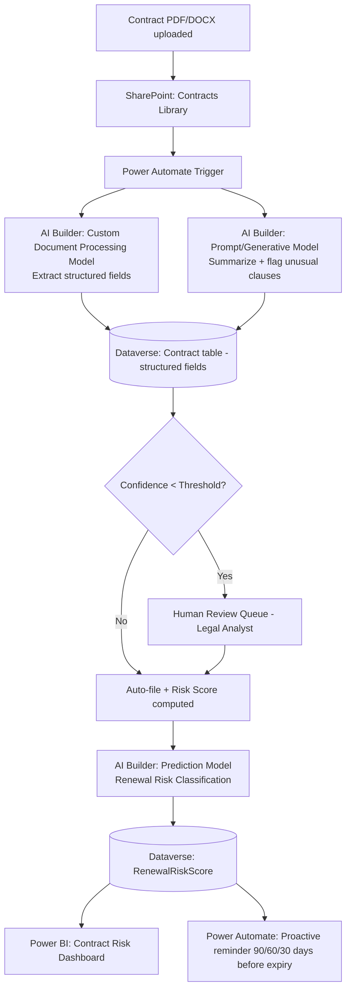

# Project 5 — DocIntelligence: AI Builder Document Processing & Predictive Insights

**Pillar:** AI Builder
**Difficulty:** Enterprise POC
**Data Source:** SharePoint (contract/document repository), Dataverse (structured extraction output + prediction training data)
**Platform baseline:** Power Platform 2026 Release Wave 1 — AI Builder deeper Foundry integration, generative AI models, prompt-based custom models

---

## 1. Business Scenario

A legal/procurement team receives hundreds of contracts and needs to:
1. Automatically extract key clauses (parties, effective date, renewal terms, liability cap, termination notice period)
2. Classify contract risk level
3. Predict likelihood of late renewal/non-renewal based on historical patterns, so the team can proactively follow up

This single project intentionally covers **three different AI Builder model types**: prebuilt/document processing, prompt-based generative extraction, and a predictive (regression/classification) model — to show breadth, not just one canned demo.

## 2. Why This Demonstrates Senior-Level Capability

- Understanding **when to use which AI Builder model type** (prebuilt vs. custom document processing vs. prompt/generative vs. classic ML prediction) — a genuinely senior architectural decision most people can't articulate
- Proper **training data governance**: versioned training sets, confidence thresholds, human-in-the-loop review queue for low-confidence extractions
- **Model lifecycle management**: training, validation, publishing, monitoring drift over time, retraining cadence
- Responsible AI considerations: bias check on the predictive model, documented limitations, and an explicit human-review gate for anything above a risk threshold

## 3. Architecture

## 4. Step-by-Step Implementation

### Phase 0 — Data Preparation & Governance
1. Assemble a labeled training set: 50+ historical contracts with ground-truth extracted fields (anonymize sensitive data).
2. Define a **data governance note**: where training documents are stored, retention period, who can access training data, and how PII is handled.

### Phase 1 — Document Processing Model
3. Build a **Custom Document Processing model** in AI Builder: define fields (Party A, Party B, Effective Date, Term Length, Renewal Notice Days, Liability Cap, Governing Law).
4. Tag 15-20 sample documents to train; validate against a held-out test set; check per-field accuracy before publishing.
5. Set a **confidence threshold** (e.g., 85%) below which extraction routes to human review instead of auto-filing.

### Phase 2 — Generative/Prompt Model
6. Build a **Prompt** (Generative AI Model, grounded via Foundry-connected model) that takes the extracted text and produces: (a) a 3-sentence plain-English summary, (b) a flag list of "unusual clauses" (e.g., uncapped liability, auto-renewal without notice).
7. Test the prompt against edge cases (very long contracts, non-English contracts) and document failure modes.

### Phase 3 — Predictive Model
8. Assemble historical data: which contracts renewed on time vs. lapsed/were renegotiated late, with features (contract value, industry, historical vendor performance, notice period length).
9. Build an AI Builder **Prediction model** (binary classification: "High risk of late renewal" yes/no).
10. Review the model's **accuracy/confusion matrix** and explicitly document known limitations (e.g., small training set size) — this honesty is what separates a credible POC from an over-promised one.

### Phase 4 — Orchestration
11. Build the **Power Automate flow** chaining all three models: extraction → generative summary/flagging → write to Dataverse → predictive scoring → conditional routing to human review.
12. Build a **90/60/30-day proactive reminder flow** using `RenewalRiskScore` + `EffectiveDate`/`TermLength` to notify contract owners before expiry — the actual business value delivery point.

### Phase 5 — Monitoring & Reporting
13. Build a **Power BI dashboard**: extraction accuracy over time (drift monitoring), volume processed, review queue backlog, top risk-flagged contracts.
14. Document a **retraining cadence** (e.g., quarterly, or after 20% drift detected) as part of the model's operational runbook.

## 5. Demo Script
1. Upload a new contract → show structured field extraction populate in Dataverse within seconds.
2. Show the generative summary + "unusual clause" flags in plain English.
3. Show a low-confidence extraction routing to the human review queue instead of silently guessing.
4. Show the predictive risk score and the proactive 90-day reminder flow it triggers.
5. Show the Power BI drift/accuracy dashboard — proves this isn't a "set and forget" toy, it's operationally monitored.

## 6. Skills This Project Proves
Multi-model AI Builder architecture, responsible AI governance, human-in-the-loop design, model lifecycle/drift monitoring — the operational maturity expected of someone deploying AI in a regulated business context.
