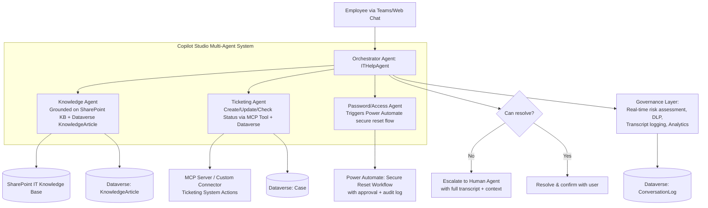

# Project 6 — ITHelpAgent: Multi-Agent IT Helpdesk built with Copilot Studio

**Pillar:** Microsoft Copilot Studio (Agents)
**Difficulty:** Enterprise POC
**Data Source:** Dataverse (Case/Knowledge tables), SharePoint (IT Knowledge Base), Power Automate (actions), MCP tools
**Platform baseline:** Power Platform 2026 Release Wave 1 — multi-agent orchestration, generative actions/orchestration, Agent Builder extension, MCP-compliant tools, real-time risk assessment/governance

---

**🔗 Live HTML mockup (look & feel preview):** [Copilot Studio mockup](https://rahul7387.github.io/powerplatform-enterprise-poc-projects/projects/06-copilot-studio-it-agent/index.html)

---

## 1. Business Scenario

IT Helpdesk fields hundreds of repetitive requests (password reset, software install request, VPN issues, ticket status checks) alongside genuinely complex issues that need a human. The goal is an agent that:
- Resolves Tier-1 requests autonomously (grounded, safe actions like triggering a password reset workflow)
- Hands off gracefully to a human agent with full context when it can't resolve something
- Uses **multi-agent orchestration** — a specialist "Knowledge Agent" for FAQ/documentation and a specialist "Ticketing Agent" for case actions, coordinated by an orchestrator agent
- Is properly governed (topics tested, DLP-compliant actions, monitored for risk)

## 2. Why This Demonstrates Senior-Level Capability

- **Multi-agent design**, not a single monolithic bot — orchestrator + specialist agents is the 2026-era best practice pattern, and shows you're not stuck on 2023-era single-topic bot design
- Real **generative orchestration**: letting the agent dynamically decide which action/plugin to invoke rather than hardcoding every conversational branch
- **Grounding on enterprise knowledge** (SharePoint KB + Dataverse) with citations, not hallucinated answers
- **MCP tool integration** — connecting the agent to a Model Context Protocol tool/server for ticketing actions, showing you understand the direction the platform is heading, not just legacy topic authoring
- Governance: escalation paths, conversation transcripts logged to Dataverse for QA, and the platform's real-time risk assessment/governance controls actually configured, not ignored

## 3. Architecture

## 4. Step-by-Step Implementation

### Phase 0 — Design the Agent Topology
1. Decide the multi-agent split: **Orchestrator** (routes intent), **Knowledge Agent** (Q&A/documentation), **Ticketing Agent** (case CRUD actions), **Password/Access Agent** (sensitive, tightly scoped actions only).
2. Write down explicit **escalation criteria** (e.g., sentiment negative twice in a row, user explicitly asks for a human, action fails twice) before building a single topic.

### Phase 1 — Knowledge Agent
3. Connect **generative answers** grounding sources: SharePoint IT Knowledge Base site + Dataverse `KnowledgeArticle` table.
4. Configure citation display so answers show their source (critical for trust and for audit).
5. Test with adversarial questions to confirm it says "I don't know" instead of hallucinating when ungrounded.

### Phase 2 — Ticketing Agent + MCP Tooling
6. Register **actions** (or an MCP-compliant tool/server) for: Create Ticket, Get Ticket Status, Update Ticket, Escalate Ticket — backed by Dataverse `Case` table and/or an external ticketing MCP server.
7. Use **generative actions/orchestration** so the agent dynamically decides which action to call and what parameters to collect via conversation, rather than a rigid decision-tree topic for every phrasing.
8. Add explicit **confirmation steps** before any state-changing action (e.g., "I'll close ticket #4521 — confirm?").

### Phase 3 — Password/Access Agent (Sensitive Actions)
9. Scope this agent narrowly — only triggers a **Power Automate flow** that itself requires secure identity verification (e.g., MFA re-challenge) before executing a reset; the agent never performs the reset directly.
10. Log every access-related action to an **audit table** in Dataverse.

### Phase 4 — Orchestrator & Handoff
11. Configure the **orchestrator agent** to route based on intent, with fallback logic and a clean **human handoff** — passing the full transcript + extracted entities to the live agent (via Teams/Omnichannel-style handoff) so the user never repeats themselves.
12. Add **multi-turn context retention** testing (agent remembers earlier parts of the conversation).

### Phase 5 — Governance & Analytics
13. Enable the platform's **real-time risk assessment** for the agent (Wave 1 governance capability) and review flagged conversations regularly.
14. Log all conversations/transcripts to a Dataverse `ConversationLog` table for QA sampling and continuous improvement.
15. Apply DLP-aligned connector restrictions so the agent can only use approved connectors/actions.
16. Set up an analytics dashboard: resolution rate without human handoff, average handling time, top failure/escalation reasons — the metric that proves ROI.

## 5. Demo script
1. Ask a common FAQ ("How do I connect to VPN?") — show grounded answer with citation.
2. Ask it to create and then check status of a ticket — show the ticketing agent's action + confirmation step.
3. Trigger a password reset request — show it hands off to the secure Power Automate flow with proper verification, not a direct unsafe action.
4. Deliberately ask something outside scope — show clean escalation to a human with full context transferred.
5. Show the governance dashboard: containment rate, risk flags, and transcript log.

## 6. Skills This Project Proves
Multi-agent orchestration design, grounded generative answers, secure action design for sensitive operations, MCP tool integration, and agent governance — this is the exact skill set organizations are hiring for in the 2026 "agentic AI" wave.
