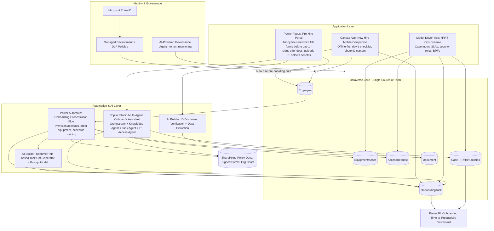

# Project 7 — CAPSTONE: OnboardX360 — Enterprise Employee Lifecycle Platform
### (Canvas App + Model-Driven App + Power Pages + Power Automate + AI Builder + Copilot Studio — all in one solution)

**Pillar:** All of Power Platform, unified
**Difficulty:** Flagship Enterprise POC — this is the one to lead with
**Data Source:** Microsoft Dataverse (system of record), SharePoint (documents/policies), Entra ID (identity)
**Platform baseline:** Power Platform 2026 Release Wave 1 (Managed Environments, GitHub-based ALM, multi-agent Copilot Studio, real-time offline Dataverse, AI-powered governance)

---

**🔗 Live HTML mockup (look & feel preview):** [Capstone mockup](https://rahul7387.github.io/powerplatform-enterprise-poc-projects/projects/07-capstone-employee-lifecycle/index.html)

---

## 1. Business Scenario

HR, IT, Facilities, and a new hire's manager all currently run **disconnected** onboarding/offboarding processes: spreadsheets, email chains, manual account provisioning requests, and a new-hire who doesn't know what to do on day one. Leadership wants **one platform covering the entire employee lifecycle** — pre-boarding, onboarding, internal case management, self-service for the employee, and offboarding — as a single governed Dataverse-based solution.

This is deliberately built to **mirror what a 15-year Power Platform architect would actually be asked to design**: not a single-screen app, but a coherent platform where every pillar has a clear, justified role — nothing added just to "check a box."

## 2. Why This Is the Project to Show Your Manager

- It tells **one coherent business story** end-to-end (a new hire's real journey) rather than six disconnected demos
- It forces (and shows you can make) **architectural trade-off decisions**: why Canvas here, why Model-Driven there, why Power Pages for the external part, why Copilot Studio and not just a form
- It has a **single Dataverse data model** all six components share — proving you understand solution architecture, not just individual app-building
- It includes **governance, security, ALM, and measurable ROI** — the things that get budgets approved and get architects promoted
- It's genuinely reusable — this exact architecture pattern (multi-app, one Dataverse core) is what most enterprises actually need, in almost any department (Finance, Legal, Facilities, Procurement)

## 3. Unified Architecture

## 4. Component Roles (The Architecture)

| Layer | Component | Why This Tool, Specifically |
|---|---|---|
| Pre-hire, external, unauthenticated-to-authenticated | **Power Pages** | The new hire has no Entra account yet — this is the *only* pillar that supports anonymous-to-authenticated external identity flows |
| Day-1+ mobile experience for the employee | **Canvas App** | Needs offline-first support (new hires often start in a training room with poor Wi-Fi/BYOD), camera access, and a highly tailored guided UX |
| Internal case/process management for HR/IT/Facilities staff | **Model-Driven App** | Data-dense, process-governed, needs BPFs, SLAs, security roles across departments — exactly the model-driven sweet spot |
| Orchestration glue between every step | **Power Automate** | Account provisioning, equipment ordering, and cross-system notifications are inherently event-driven workflows |
| Document/ID verification and personalized task generation | **AI Builder** | Structured extraction (ID documents) and generative task-list personalization based on role/department |
| Conversational self-service for the new hire and hiring manager | **Copilot Studio** | Reduces "who do I ask" friction; multi-agent design routes IT-access questions vs. general policy questions vs. task-status questions appropriately |
| Single system of record | **Dataverse** | Every layer above reads/writes the same governed data model — this is what makes it one platform, not six prototypes glued together |

## 5. Step-by-Step Implementation Plan

### Phase 0 — Foundation (Week 1)
1. Provision a dedicated **Managed Environment**; define DLP policy covering all connectors used across all six components.
2. Design the **unified Dataverse schema**: `Employee`, `OnboardingTask`, `Equipment`, `AccessRequest`, `Case`, `Document`, with relationships mapped before any app is built.
3. Define **security roles and Business Units** spanning HR, IT, Facilities, and Managers — shared consistently across the Model-Driven app and Power Pages table permissions.

### Phase 1 — Pre-Hire Portal (Power Pages)
4. Build anonymous → authenticated registration flow for new hires (offer acceptance, ID upload, benefits elections).
5. Wire **AI Builder ID verification** to extract and validate uploaded ID documents; low-confidence results route to HR review.
6. On submission, trigger the **Onboarding Orchestration flow**.

### Phase 2 — Orchestration (Power Automate)
7. Build the master flow: create `Employee` record → provision status placeholders for account creation/equipment → generate a **personalized task list** via an AI Builder prompt model (role + department aware) → notify manager, IT, and Facilities.
8. Include the try/catch exception-handling pattern and a `Case` auto-creation on any provisioning failure, routed into the Model-Driven Ops console.

### Phase 3 — Day-1 Companion (Canvas App)
9. Build an **offline-first** canvas app for the new hire's phone: guided checklist (`OnboardingTask` records), building map, "who's who" org chart pull from SharePoint, and an embedded chat entry point into Copilot Studio.

### Phase 4 — Internal Ops Console (Model-Driven App)
10. Build the HR/IT/Facilities console: Case management with BPF stages, SLA timers on `AccessRequest` and `Equipment` fulfillment, dashboards per department, hierarchy security for managers.

### Phase 5 — Conversational Layer (Copilot Studio)
11. Build the **multi-agent OnboardX Assistant**: Orchestrator + Knowledge Agent (policy/FAQ grounded on SharePoint) + Task Agent (reads/updates `OnboardingTask`) + IT Access Agent (creates `AccessRequest`, escalates via secure flow).
12. Embed the assistant in both the Canvas App and the Power Pages portal for a consistent experience across touchpoints.

### Phase 6 — Measurement & Governance
13. Build a **Power BI dashboard**: time-to-productivity (offer accepted → fully provisioned), task completion rate, case volume by department, Copilot containment rate.
14. Enable the **AI-powered governance agent** at the tenant level to continuously monitor this solution's health, connector usage, and risk.
15. Set up **GitHub-based ALM**: solution exported and version-controlled in this very repo, pipeline promoting Dev → Test → Prod with automated solution-checker gates.

## 6. Demo script
1. **Pre-hire**: Show a "new hire" completing the Power Pages portal — ID upload auto-verified by AI Builder.
2. **Automation fires**: Show the Power Automate run provisioning tasks, generating a personalized task list via AI, and notifying IT/Facilities/Manager.
3. **Day 1**: Open the Canvas App on a phone in airplane mode — show the offline checklist still works, then reconnect and show sync.
4. **Ask the assistant**: In the Canvas App, ask the Copilot "What's my WiFi setup task status?" and "Who do I contact for badge access?" — show it routing to the right specialist agent.
5. **Ops view**: Switch to the Model-Driven console as an HR/IT admin — show the case created automatically when equipment provisioning failed, SLA timer running.
6. **Prove the ROI**: Show the Power BI time-to-productivity dashboard, before/after automation.
7. **Prove the governance**: Show the solution in this GitHub repo with pipeline history, and the tenant governance agent's health view.

## 7. Skills This Project Proves
This single project demonstrates end-to-end solution architecture across the entire Power Platform: data modeling, multi-app UX strategy, security design across internal and external identities, intelligent automation, AI Builder + generative AI integration, multi-agent conversational design, and enterprise ALM/governance — the complete profile of a Principal/Staff-level Power Platform Solution Architect.
